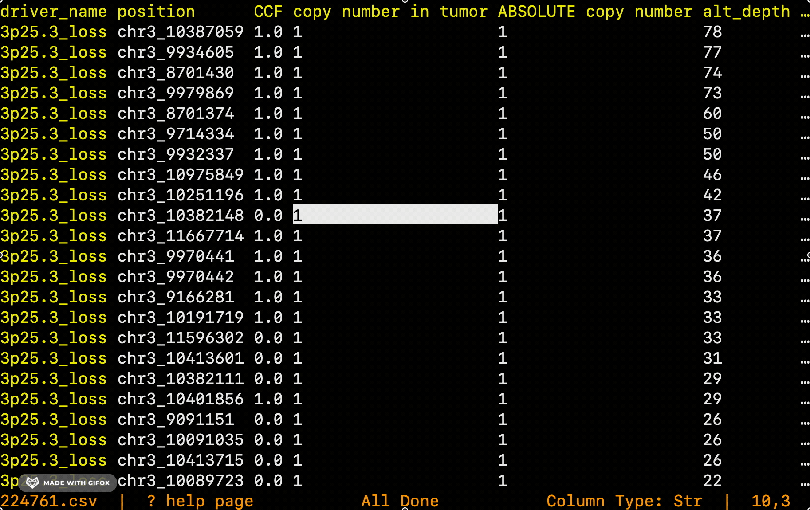

# tv(table viewer) for delimited file in terminal
[](http://GitHub.com/codechenx/tv/releases)
[](https://travis-ci.org/codechenx/tv)
[](https://codecov.io/gh/codechenx/tv)
[](https://goreportcard.com/report/github.com/codechenx/tv)
[](https://godoc.org/github.com/codechenx/tv)
[](https://github.com/codechenx/tv/blob/master/LICENSE)

#### Description

tv is a tool to view the delimited file in terminal.

for bioinformaticians, you can use [bv](https://github.com/codechenx/bv),which provide more format support for bioinformatics data


 


# Table of Contents

- [Description](#description)
- [Feature](#feature)
- [To do](#to-do)
- [Installation](#installation)
  - [Prebuilt binaries](#prebuilt-binariesonly-64bit)
  - [Build from source](#build-from-source)
- [Key binding](#key-binding)
- [Usage](#usage)
- [(Extra)Examples for common biological data](#extraexamples-for-common-biological-data)

# Feature

- Spreadsheet-like view for delimited data
- Vim-like key binding 
- Support for gzip compressed file
- Automatically identify tsv and csv format(Experimental)

# To do

- [ ] search string
- [ ] sort values of column


# Installation

### Prebuilt binaries(only 64bit)

#### Linux and macOS
```bash
$ curl https://raw.githubusercontent.com/codechenx/tv/master/install.sh | bash
```

#### Window
download from [releases](https://github.com/codechenx/tv/releases) 

### Build from source

 Use go get to install and update:
```bash
$ go get -u github.com/codechenx/tv
```
# Key binding

| Key               | description              |
| ----------------- | ------------------------ |
| h, left arrow     | Move left by one column  |
| l, right arrow    | Move right by one column |
| j, down arrow     | Move down by one row     |
| k, up             | Move up by one row       |
| g, home           | Move to the top          |
| G, end            | Move to the bottom       |
| Ctrl-F, page down | Move down by one page    |
| Ctrl-B, page up   | Move up by one page      |

# Usage

Usage: tv [--sep SEP] [--ss SS] [--sn SN] [--rc RC] [--hc HC] [--h H] [--t] FILENAME

Positional arguments:
  FILENAME

Options:
  - --sep SEP, -s SEP      split symbol [default: ""]
  - --ss SS                ignore lines with specific prefix(support for multiple arguments, separated by space) [default: []]
  - --sn SN                ignore first n lines [default: 0]
  - --rc RC                show columns(support for multiple arguments, separated by space) [default: []]
  - --hc HC                hide columns(support for multiple arguments, separated by space) [default: []]
  - --h H                  -1, no column name and row name; 0, use first row as row name; 1, use first column as column name; 2, use firt column as column name and first row as row name [default: 0]
  - --t                    transpose and view data [default: false]
  - --help, -h             display this help and exit
  - --version              display version and exit

# (Extra)Examples for common biological data
```bash
#vcf or compressed vcf format
tv file.vcf --ss "##"
tv file.vcf.gz --ss "##"
#qiime otu table
tv file.txt --ss "# "
#maf format
tv file.maf --ss "#"
#interval list
tv file.interval_list --ss "@HD" "@SQ"
tv file.interval_list --ss "@"
# bed 
tv file.bed --h -1

```
