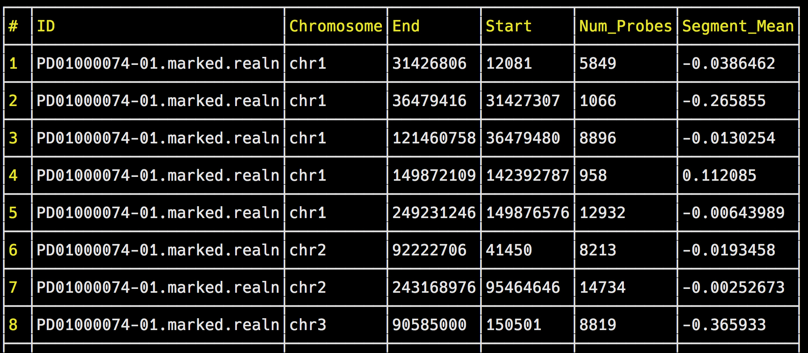

# tv(table viewer) for delimited file in terminal
[](http://GitHub.com/codechenx/tv/releases)
[](https://travis-ci.org/codechenx/tv)
[](https://codecov.io/gh/codechenx/tv)
[](https://goreportcard.com/report/github.com/codechenx/tv)
[](https://github.com/codechenx/tv/blob/master/LICENSE)

#### Description

 tv is tool to view delimited file in terminal
 
 


# Table of Contents
- [Description](#description)
- [To do](#to-do)
- [Installation](#installation)
  - [Prebuilt binaries](#prebuilt-binaries)
  - [Build from source](#build-from-source)
- [Key binding](#key-binding)
- [Usage](#usage)
 
# To do

- [ ] search string
- [ ] sort value of column(row)


# Installation

### Prebuilt binaries
```bash
$ curl https://github.com/codechenx/tv/blob/master/install.sh | bash
```

### Build from source
 Use go get to install and update:
```bash
$ go get -u github.com/codechenx/tv
```
# Key binding

- h, left arrow: Move left by one column.
- l, right arrow: Move right by one column.
- j, down arrow: Move down by one row.
- k, up arrow: Move up by one row.
- g, home: Move to the top.
- G, end: Move to the bottom.
- Ctrl-F, page down: Move down by one page.
- Ctrl-B, page up: Move up by one page.

# Usage

Usage: tv [--sep SEP] [--ss SS] [--h H] FILENAME

Positional arguments:
  FILENAME

Options:
  --sep SEP, -s SEP      split symbol
  
  --ss SS                 skip line with prefix of symbol
  
  --h H                   -1 for neither of ColumnName and RowName 0 for only ColumnName, 1 for only RowName, 2 for both of ColumnName and RowName
 
  --help, -h             display this help and exit
  
  --version              display version and exit
